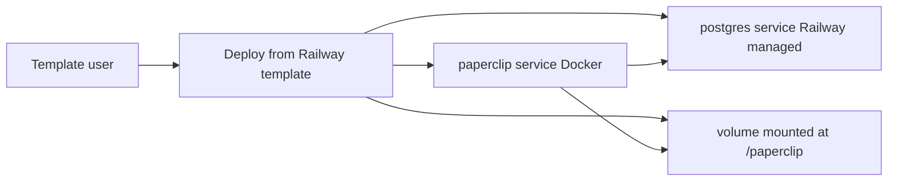

# Paperclip Railway Template

This project is the implementation package and template source repository for publishing a Railway one-click deploy for Paperclip.

Use this folder as the source of truth while building, validating, and publishing the template.

## Final target

- One-click deployable Railway template
- Public marketplace listing
- Reliable persistence by default:
  - Railway Postgres for relational data
  - Railway Volume mounted to `/paperclip` for Paperclip state/config files
- Secure defaults for auth and deployment exposure
- Track upstream Paperclip releases via pinned adapter Docker ref

## Recommended architecture

## Create the template (Railway UI)

1. Open `railway-template-spec.md` and follow it exactly in the Railway template composer.
2. Configure services, variables, public networking, and volume mount exactly as defined.
3. Validate deploy and persistence behavior using `validation-runbook.md`.
4. Use `marketplace-copy.md` and `marketplace-overview.md` for listing content.
5. Complete every gate in `publish-checklist.md` before publishing.
6. After publish, add deploy button links and record final URLs.

## Recommended repository model

Create and maintain a dedicated public repository for this template so users can file deployment-specific issues and submit PRs.

- Setup guide: `REPO_SETUP.md`
- Support policy: `SUPPORT.md`
- Contribution guide: `CONTRIBUTING.md`

For exact environment variables and values, use `template-config.md` and `railway-template-spec.md`.
For listing text, use `marketplace-copy.md`.
For the long-form marketplace overview, use `marketplace-overview.md`.
For validation and persistence testing, use `validation-runbook.md`.

## Why Docker-first

This repository includes a Railway-compatible adapter `Dockerfile` that builds pinned upstream Paperclip releases while avoiding Railway-blocked Dockerfile directives like `VOLUME`. This gives users deterministic deploys without maintaining a long-lived app fork.

## Deterministic release pinning

The adapter `Dockerfile` pins upstream Paperclip using:

- `ARG PAPERCLIP_REF=<release-tag>`

This keeps template deploys deterministic. To move to a newer upstream release, bump the pin intentionally:

- `node scripts/bump-paperclip-ref.mjs` (requires `GITHUB_TOKEN`)

## Validation checklist

- App serves successfully on Railway public URL.
- Login/auth flow initializes.
- DB connection is healthy.
- Data persists after service restart/redeploy:
  - create test state
  - restart service
  - confirm state still exists

## Required release bar

Do not publish unless all of the following are true:

- Managed Postgres is configured and connected to `DATABASE_URL`
- A Railway Volume is attached at `/paperclip`
- `BETTER_AUTH_SECRET` is generated and hidden
- Restart and redeploy persistence tests both pass

## Implementation artifacts

- `railway-template-spec.md` - authoritative template composer settings
- `template-config.md` - variables and service defaults
- `Dockerfile` - Railway-compatible adapter image pinned to upstream Paperclip release
- `railway.toml` - Railway config-as-code defaults for Docker deploy and healthcheck
- `validation-runbook.md` - deployment + persistence validation sequence
- `publish-checklist.md` - publish gates
- `marketplace-copy.md` - template marketplace listing text
- `marketplace-overview.md` - Railway overview content in recommended structure
- `TEMPLATE_CHANGELOG.md` - template update notes for consumers
- `REPO_SETUP.md` - GitHub repo bootstrap checklist
- `SUPPORT.md` - support scope and issue expectations
- `CONTRIBUTING.md` - contribution workflow and quality bar

## Source references

- Paperclip repository: https://github.com/paperclipai/paperclip
- Railway template docs: https://docs.railway.com/templates/create
- Railway publish docs: https://docs.railway.com/templates/publish-and-share
- Railway best-practices docs: https://docs.railway.com/templates/best-practices
- Railway updates docs: https://docs.railway.com/templates/updates
- Railway template repository context: https://github.com/railwayapp/templates
